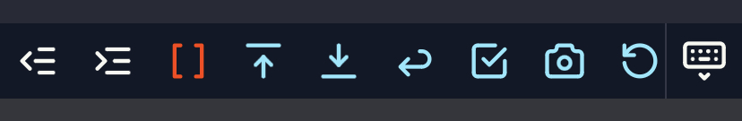

+++
title = "Reordering Mobile Editing Icons in LogSeq"
slug = "logseq-mobile"
author = "Colin Bate"
description = "I found a way to avoid needing to constantly scroll sideways to access the icons I need."
pubDate = 2023-05-05T12:00:00Z
tags = [ "logseq", "css", "flex" ]

[image]
local = "./2023-05-05-logseq-mobile.jpg"
alt = "Phone with LogSeq logo."
+++
At first glance, the `order` CSS property may not seem that useful. But every once in a while, you are glad that it is there. I recently came across one such situation.

I use an application called [LogSeq][ls] as my personal knowledge management tool. My goal isn't to talk about LogSeq here; that is likely a whole article on its own. However, there are some relevant facts about it that will be useful.

LogSeq allows for the creation of links using the **[[double square brackets]]** model, and when using their mobile application, they provide an extra toolbar with an icon to insert those brackets. Unfortunately, that icon is on the right side of that extra toolbar, off the screen, while another common icon is located on the left. This had me constantly swiping left and right as I needed those different icons.

My desire to be lazy about this lead me to search for a solution, but I couldn't find one. The code revealed there was no way to customize the order. However, LogSeq is an Electron app and does support a `custom.css` for theming and visual customization. Maybe that holds the answer?

Back into the codebase, I determined that the mobile editor bar used `display: flex;` to render the row of icons. I just needed to select the `<div>` that contains the brackets and change the order. I was able to determine the class of the icon I wanted, and thought that this is a great use of the `:has()` selector since the `<div>` that needs to be ordered is an ancestor to the icon itself. Unfortunately, the verson of Electron being used by LogSeq at the moment doesn't support `:has()`.

So this is where `:nth-child()` comes to the rescue. It lets you target a specific numbered element in a list of sibling elements. So in this case, I can target the 11th icon. It's a bit brittle if they ever decide to alter the order, but easy enough to update. Since I wanted to insert this icon into the third position on the bar, I needed to reorder the existing icons from third onward to be `order: 2;`. This allowed me to then set the 11th icon to `order: 1;`.

You can see the CSS I added to my `custom.css` below. The colors were there to visualize the change, but I like maintaining that distinction, so I've left them in.

```css
/* Move icons 3+ to order 2 */
#mobile-editor-toolbar .toolbar-commands > div:nth-child(n+3) {
  order: 2;
  color: var(--cyan);
}

/* Insert icon 11 (brackets) at order 1 */
#mobile-editor-toolbar .toolbar-commands > div:nth-child(11) {
  order: 1;
  color: var(--orange);
}
```

You can see the the results here.

<div class="as-is">



</div>

[ls]: https://logseq.com